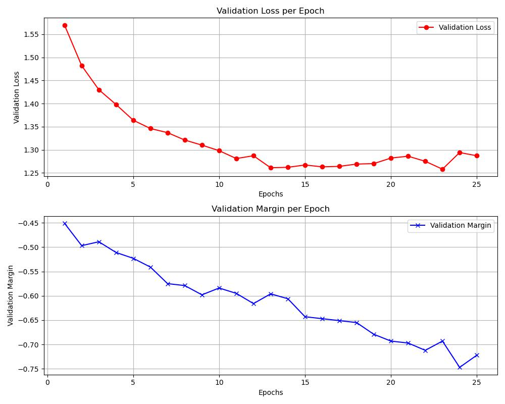
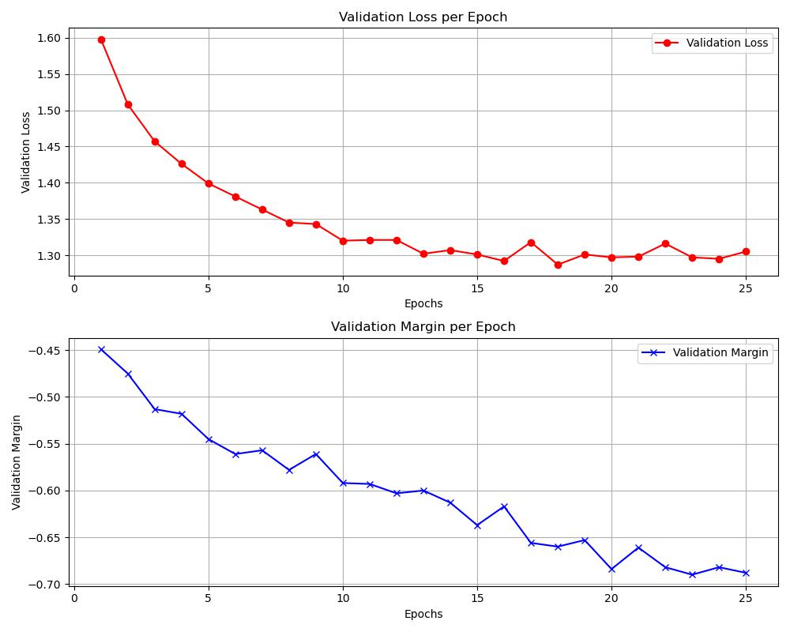

CS89/189: Deep Learning Generalization and Robustness - Winter 2024
Homework#1

Yenkai Huang


## Explain why sometimes the margin can be negative.
 
The margin in the context of machine learning classification can indeed be negative. The margin, defined as` μ(f(x), y) = f(x)[y] − max_{i ≠ y} f(x)[i]`, measures the difference between the correct class's prediction score and the highest prediction score of the incorrect classes. A negative margin occurs when the highest score among the incorrect classes exceeds the score of the correct class. This indicates that the model has a higher confidence in an incorrect classification than the true class, which reflects on the model's current inability to correctly distinguish between classes for that particular instance.

## Your proof of the CNN output volume formula 

1. When you apply `n*n` filter on a `N*N` input, the output will be `N - n + 1`
2. If you add the `Z` padding (on all sides of edges) the input to expand the size of the out put, the output will be `N - n + 2*Z +1`
3. If we add `S` stride to the filtering process, the output will be `(N - n + 2*z)/S + 1`
4. Having the same filtering process with `V'` filters, we have the final output of `M * M * V'` where M = `(N - n + 2*z)/S + 1`


## Report your

### Model 1
```
=================== Model 1 ===================
Training loss: 0.820   Training margin -0.505    Training accuracy: 0.726   Validation accuracy: 0.564

Frobenius1:      20.7
Frobenius2:      6.73
Distance1:       8.99
Distance2:       5.45
Spectral1:       1.91
Spectral2:       3.14
Fro_Fro:         1.4e+02
L1max_L1max:     2.28e+03
Spec_Dist:       32.9
Dist_Spec:       9.02e+02
Spec_Dist_sum:   9.35e+02
Spec_L1max:      32.7
L1max_Spec:      8.79e+02
Spec_L1max_sum:  9.12e+02
Dist_Fro:        60.5
#parameter:      3.16e+06
VC bound:        9.19e+09
L1max bound:     4.59e+11
Your bound:      1.87e+11
```



### Model2
```
=================== Model 2 ===================
Training loss: 0.967   Training margin -0.539    Training accuracy: 0.672   Validation accuracy: 0.554

Frobenius1:      12.3
Frobenius2:      5.49
Distance1:       8.15
Distance2:       4.2
Spectral1:       1.87
Spectral2:       2.76
Fro_Fro:         67.4
L1max_L1max:     1.25e+03
Spec_Dist:       24.9
Dist_Spec:       3.59e+02
Spec_Dist_sum:   3.84e+02
Spec_L1max:      24.7
L1max_Spec:      3.53e+02
Spec_L1max_sum:  3.78e+02
Dist_Fro:        44.7
#parameter:      7.89e+05
VC bound:        2.03e+09
L1max bound:     1.2e+11
Your bound:      3.84e+10
```


In general, `model1` has more hidden units which make the model to learn more information from the input hence why the margin and bound greater than `model2`.  If we want to minimize the the difference between the two models, we can use regularization to increase the margin of `model2`.